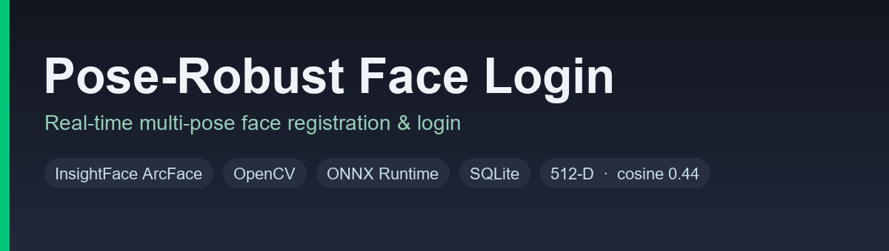
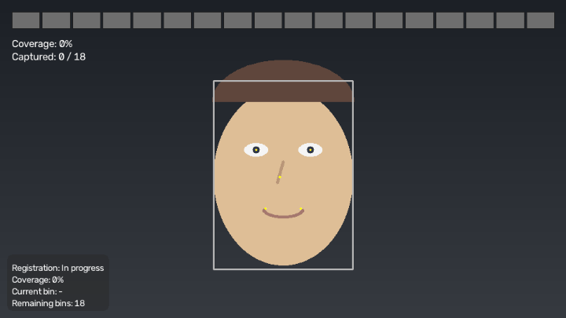
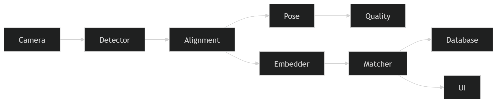
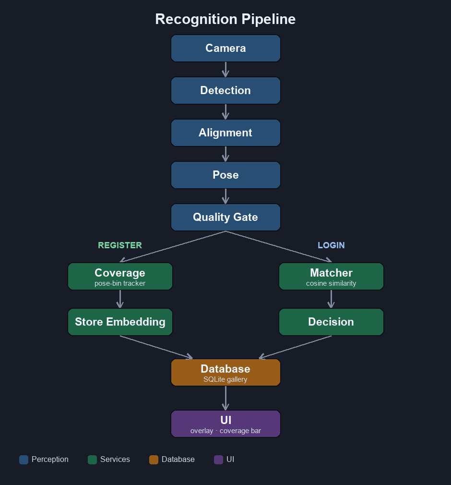
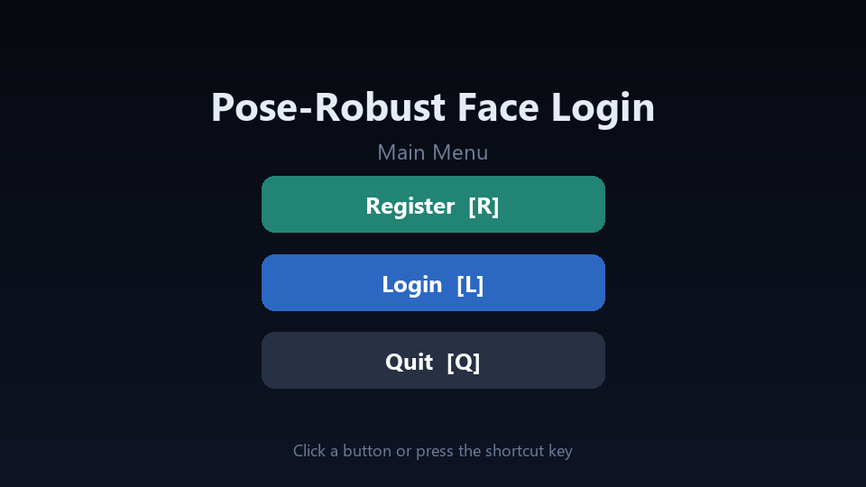
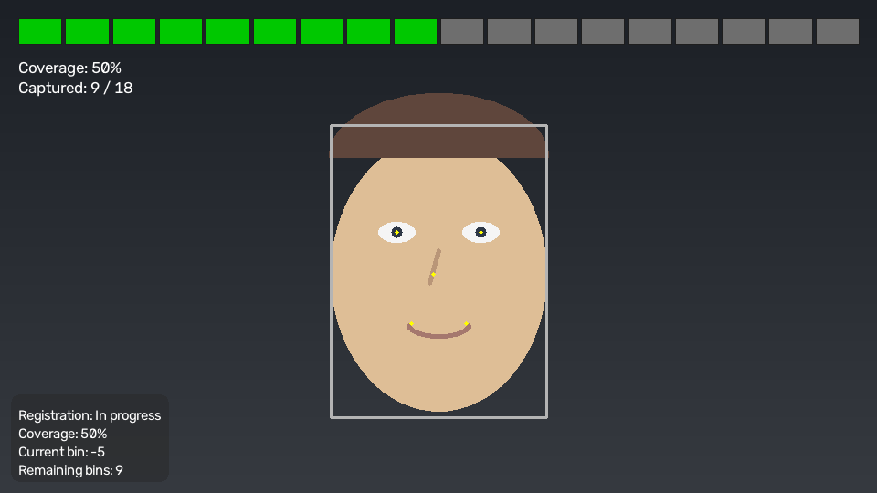
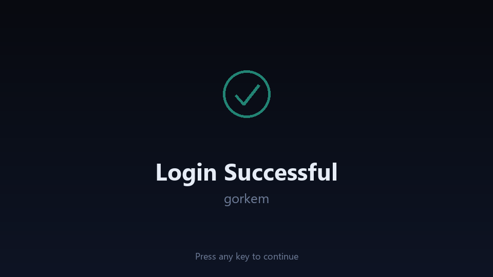

<p align="center">
  
</p>

<h1 align="center">Pose-Robust Face Login</h1>

<p align="center">
Real-time face registration and authentication robust to large head-pose variations.
</p>

<p align="center">
  
  
  
  
</p>

A **real-time desktop** face registration and login system built for pose
robustness. Users enrol across multiple head poses (frontal to profile), and
authentication is performed live from the webcam. Recognition uses
**InsightFace ArcFace** (`buffalo_l`) 512-D embeddings compared by cosine
similarity, with **OpenCV** for capture and rendering, **ONNX Runtime** for
model inference (CPU or CUDA), and **SQLite** for the embedding gallery.

No face images are ever stored — only normalized embeddings and their pose /
quality metadata.

<p align="center">
  
</p>

<p align="center"><em>Live demo — multi-pose registration filling the coverage bar, then a successful login. (Illustrative UI render.)</em></p>

---

## Features

- **Multi-pose enrollment** — guided capture across yaw bins from −90° to +90°.
- **Real-time login** — live webcam authentication with a cosine-similarity decision.
- **ArcFace embeddings** — 512-D, L2-normalized vectors from `buffalo_l`.
- **Head-pose estimation** — yaw / pitch / roll via `solvePnP` over five landmarks.
- **Automatic quality filtering** — rejects small, blurry, low-confidence, or low-pose-confidence frames before they are stored.
- **SQLite gallery** — users, embeddings, sessions, and schema metadata; embeddings stored as float32 BLOBs (no Pickle).
- **Coverage tracking** — deterministic pose-bin occupancy map with progress and remaining-pose guidance.
- **Clean Architecture** — perception, application/services, persistence, and UI layers are decoupled and independently testable.

---

## Pipeline

<p align="center">
  
</p>

```text
Camera
   ↓
Detection        (InsightFace / RetinaFace)
   ↓
Alignment        (112×112 normalized RGB crop)
   ↓
Pose             (yaw / pitch / roll, solvePnP)
   ↓
Quality          (size · blur · confidence · pose · embedding norm)
   ↓
Embedding        (ArcFace 512-D, L2-normalized)
   ↓
Register / Login (coverage capture  |  cosine matcher)
   ↓
Database         (SQLite: users · embeddings · sessions · metadata)
   ↓
UI               (overlay · coverage bar · window)
```

During **registration** the branch runs Coverage → (on a new pose bin) store the
embedding. During **login** the branch runs Matcher → decision → session log.

---

## Architecture

The code follows Clean Architecture: perception adapters and persistence sit
beneath the service layer, and the UI is decoupled from the pipeline.

<p align="center">
  
</p>

| Package         | Responsibility                                                                                                                                                                                                       |
| --------------- | -------------------------------------------------------------------------------------------------------------------------------------------------------------------------------------------------------------------- |
| **`cv/`**       | Computer-vision adapters:`camera` (capture), `detector` (InsightFace detection), `alignment` (`norm_crop`), `pose` (solvePnP head pose), `quality` (quality gate), `embedder` (ArcFace embeddings). Perception only. |
| **`services/`** | Application/service layer:`coverage` (pose-bin tracker), `matcher` (cosine nearest-neighbour), `register` (enrolment workflow), `login` (authentication workflow).                                                   |
| **`database/`** | Persistence:`database` (SQLite connection, WAL, transactions, blob helpers), `schema` (DDL), `repository` (the **only** SQL gateway, maps rows ↔ dataclasses).                                                       |
| **`ui/`**       | Presentation:`overlay` (boxes/landmarks/panels), `coverage_bar` (segmented coverage bar), `window` (OpenCV window + keystroke forwarding). Pure rendering.                                                           |
| **`configs/`**  | `config.yaml` — all runtime defaults, loaded into typed, immutable dataclasses.                                                                                                                                      |
| **`models/`**   | Local model root; the`buffalo_l` pack lives in `models/buffalo_l/`.                                                                                                                                                  |

Top-level `app.py` is the composition root that wires every component and runs
the loop; `config.py` and `logging_setup.py` provide centralized config and
logging.

---

## Installation

**Requirements:** Python **3.12+**, a webcam, and (optionally) a CUDA-capable
GPU for acceleration.

```bash
# 1. Clone
git clone https://github.com/gorkemergune/pose-robust-face-login.git
cd pose-robust-face-login

# 2. Create and activate a virtual environment
python -m venv .venv
# Windows
.venv\Scripts\activate
# macOS / Linux
source .venv/bin/activate

# 3. Install dependencies
pip install opencv-python insightface numpy pyyaml pillow onnxruntime
#   For CUDA acceleration, install the GPU runtime instead of onnxruntime:
#   pip install onnxruntime-gpu
```

**Model download.** The `buffalo_l` pack (~275 MB) is downloaded automatically by
InsightFace into `models/buffalo_l/` on first run — the app clears an empty
placeholder folder if one is present so the download can proceed. To run
offline, place the pack's `.onnx` files (including `w600k_r50.onnx`) there
manually.

```bash
# 4. Run
python -m face_login
```

---

## Usage

Launch with `python -m face_login`. The **main menu** opens:

<p align="center"></p>

- **Kayıt Ol / Register** — click the button or press **`R`**, type a user name and
  press **Enter** (or click **Gönder**). The camera opens and guides you through a
  **180° scan**: turn your head slowly left ↔ right while the coverage bar fills.
  Live feedback shows when a pose is **captured** (green) or why a frame was
  **rejected** (red — e.g. "Sabit durun", "Kameraya yaklaşın"), plus a directional
  hint ("Başınızı sola çevirin"). When every pose bin is covered, registration is
  **saved** automatically. Re-registering an existing name overwrites the old data.

  

  _Registration scan: the segmented coverage bar (green = captured, gray =
  remaining) with live progress and per-pose feedback. (Illustrative UI render.)_

- **Giriş Yap / Login** — click the button or press **`L`**. Show your face to the
  camera; once recognized you are greeted with **"Hoş geldin, &lt;name&gt;!"** and then
  a **"Giriş Başarılı"** confirmation screen.

  <p align="center"></p>

**Controls**

| Input          | Action                             |
| -------------- | ---------------------------------- |
| Click / `R`    | Register                           |
| Click / `L`    | Login                              |
| `Enter`        | Submit name                        |
| `Esc`          | Back / cancel the current scan     |
| `Q`            | Quit (from menu or result screens) |
| _any key_      | Continue from a result screen      |

---

## Database Schema

SQLite with foreign keys and WAL journaling. Managed exclusively through the
repository layer.

- **`users`** — `id`, unique `name`, `created_at`. One row per enrolled person.
- **`embeddings`** — `id`, `user_id` → `users(id)` (`ON DELETE CASCADE`),
  `yaw_center`, `quality_score`, `embedding` (float32 BLOB), `created_at`. One
  row per captured pose bin.
- **`sessions`** — `id`, `user_id` → `users(id)` (`ON DELETE SET NULL`),
  `similarity`, `success`, `created_at`. An audit log of authentication attempts.
- **`metadata`** — `key`/`value` pairs (`schema_version`, `embedding_model`,
  `embedding_dimension`) for forward-compatible migrations.

No face images are persisted — embeddings are stored as raw float32 bytes, never
Pickle.

---

## Configuration

All runtime behavior is driven by **`configs/config.yaml`**, loaded into typed,
immutable dataclasses (`face_login/config.py`). Missing keys fall back to the
in-code defaults. Sections:

| Section       | Key defaults                                                                                  |
| ------------- | --------------------------------------------------------------------------------------------- |
| `app`         | window/application name                                                                       |
| `logging`     | `level`, `file`, `format`                                                                     |
| `camera`      | `index`, `width`, `height`, `target_fps`                                                      |
| `detection`   | `model_name: buffalo_l`, `det_size: 640`, `det_threshold: 0.5`                                |
| `alignment`   | `image_size: 112`                                                                             |
| `pose`        | `yaw_min: -90`, `yaw_max: 90`                                                                 |
| `quality`     | `blur_threshold`, `brightness_min/max`, `min_face_size`, `min_confidence`, `stability_frames` |
| `coverage`    | `yaw_bins: 18`, `yaw_min: -90`, `yaw_max: 90`                                                 |
| `recognition` | `embedding_dim: 512`, `threshold: 0.44`                                                       |
| `database`    | `path`                                                                                        |

---

## Performance

| Metric              | Target / Value                            |
| ------------------- | ----------------------------------------- |
| Recognition latency | **< 100 ms** per frame                    |
| Registration time   | **< 30 s** for full pose coverage         |
| Embedding dimension | **512** (ArcFace `buffalo_l`)             |
| Decision threshold  | **0.44** cosine similarity (configurable) |

Head-pose angles are estimated with an approximate canonical 3D face model and
uncalibrated intrinsics, so they are intended for **pose binning and guidance**,
not precise angular measurement.

---

## Limitations

- **Pose range** — the system supports **frontal to profile (−90° to +90°)** of
  yaw. This is the range across which facial landmarks and identity features
  remain visible.
- **Rear-facing heads are out of scope** — a completely turned-away head exposes
  no facial information, so it cannot be detected, aligned, embedded, or matched.
- **No multi-face tracking** — a single (primary) face is processed per frame.
- **Desktop application only** — this is not a web or mobile application; it
  requires a local webcam and display.

---

## License

Released under the **Apache License 2.0**. See [LICENSE](LICENSE) for details.
